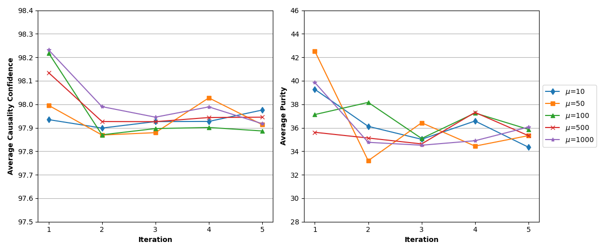
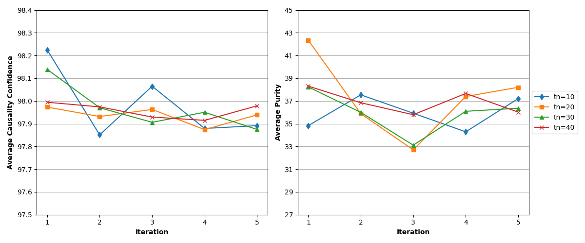

# Iterative Topic Modeling Framework with Time Series Feedback

## Abstract

As part of our final project for CS410 Text Information Systems, we are reproducing paper "Topic Modeling Framework with Time Series Feedback". We chose to reproduce experiment of *2000 U.S. Presidential election campaign* due to its low data size. We followed the steps and algorithm as mentioned in the paper and were able to get results which are very similar to results provided in the paper.
With this project, we learnt about Topic Modeling and how topic modeling combined with TimeSeries feedback can be used to explain the relation between text and
non-text time series.

## Authors

### Team BestBots

| Name                | NetId                 |
| ------------------- | --------------------- |
| Maneesh Kumar Singh | mksingh4@illinois.edu |
| Sonal Sharma        | sonals3@illinois.edu  |
| Kamlesh Chegondi    | kamlesh2@illinois.edu |

## Table of Contents

- [Iterative Topic Modeling Framework with Time Series Feedback](#iterative-topic-modeling-framework-with-time-series-feedback)
  - [Abstract](#abstract)
  - [Authors](#authors)
    - [Team BestBots](#team-bestbots)
  - [Table of Contents](#table-of-contents)
  - [Project Video](#project-video)
  - [Algorithm](#algorithm)
    - [Parameters](#parameters)
      - [Time series data](#time-series-data)
      - [Collection of documents with ts from same period](#collection-of-documents-with-ts-from-same-period)
      - [Topic modeling method M](#topic-modeling-method-m)
      - [Causality measure C](#causality-measure-c)
      - [tn](#tn)
      - [mu μ](#mu-μ)
      - [Gamma 𝛾](#gamma-𝛾)
      - [Delta δ](#delta-δ)
    - [Output](#output)
    - [Steps](#steps)
  - [How to run?](#how-to-run)
    - [Initial Setup](#initial-setup)
    - [Run program](#run-program)
  - [DataSet](#dataset)
    - [NYT Corpus data](#nyt-corpus-data)
    - [IEM 2000 Winner takes all data](#iem-2000-winner-takes-all-data)
    - [Data preprocessing](#data-preprocessing)
      - [NY Times Corpus](#ny-times-corpus)
      - [IEM Winner takes all data](#iem-winner-takes-all-data)
      - [Handling of missing data](#handling-of-missing-data)
      - [Stop words removal](#stop-words-removal)
  - [Implementation](#implementation)
  - [Hurdles and Ladders](#hurdles-and-ladders)
  - [Final Results](#final-results)
    - [Significant Topics 2000 Presidential Election](#significant-topics-2000-presidential-election)
    - [Quantitative Evaluation Results](#quantitative-evaluation-results)
  - [Conclusion](#conclusion)
  - [Acknowledgments](#acknowledgments)
  - [References](#references)
  - [Appendix](#appendix)
    - [Evaluation System](#evaluation-system)
    - [Software/Tools used](#softwaretools-used)

## Project Video

<https://youtu.be/bP7eKOCasVU>

## Algorithm

### Parameters

#### Time series data

X = x_1, ... , x_n with timestamp (t_1, t_2, ..., t_n)

#### Collection of documents with ts from same period

D = {(d1,td1),..,(dm,tdm)}

#### Topic modeling method M

Identifies topics

#### Causality measure C

Significance measures (e.g. p-value) and impact orientation

#### tn

How many topics to model

#### mu μ

strength of the prior

#### Gamma 𝛾

Significance Threshold

#### Delta δ

Impact Threshold

### Output

k potentially causal topics
(k<=tn): (T1,L1),... (Tk, Lk)

### Steps


1. Apply M to D to generate tn topics T1,..,TN
2. Use C to find topics with significance value sig(C,X,T) > gamma(95%)
   CT: set of candidates causal topics with lags {(tc1, L1),..,(tck,Lk)}.
3. For each candidate topic CT, apply C to find most significant
   causal words among top words w subset of T.
   Record the impact values of these significance words (e.g. word-leave Pearson
   correlations with time series variable)
4. Define a prior on the topic model parameters using significant terms and impact values
   1. Separate positive impact terms and negative impact terms
      If orientation is very weak ( delta < 10%) ignore minor group
   2. Assign prior probabilities proportions according to significance levels
5. Apply M to D using prior obtained in step 4.
6. Repeat 2-5 until satisfying stopping criteria (e.g. reach topic quality at some point,
no more significant topic change). When the process stops, CT is the output causal topic
list.

## How to run?

This program has been tested for python 3.8.5. It may work for older version of python
(>=3.6), but was not tested. Here are the instructions to run this program.

### Initial Setup

This program can be run with or without virtual environment setup. However virtual
environment is highly recommended. Below are the steps required for Ubuntu 20.04.1 LTS.

```bash
# install virtualenvwrapper
pip3 install virtualenvwrapper --user

# Setup virtualenvwrapper path if not already done
export PATH="$HOME/.local/bin:$PATH"

# If python3 is aliased on your system, you need to
# setup environment variable for virtualenvwrapper to
# know where to pick python
export VIRTUALENVWRAPPER_PYTHON=/usr/bin/python3

# Source virtualenvwrapper.sh so that all helper
# commands are added to path
source ~/.local/bin/virtualenvwrapper.sh

# Make virtualenv. *demo* can be any name.
mkvirtualenv demo

# Clone the repository
git clone https://github.com/sonalsharma5990/CourseProject.git

# install dependencies
cd CourseProject/src
pip install -r requirements.txt
```

### Run program

There are three options to run the program.

Below command uses the saved model to find significant topics
and words. As it does not need to train the model, it is the fastest
option and finishes in less than 5 minutes.

```bash
python main.py
```

You can also train the model again. Below command trains the model
using the prior strength mu and eta (topic_word_prob) for 5 iterations.
Please note currently it is not possible to set the mu, eta or
number of iteration options from command line. These must be changed in
code.

As this option trains the model five times (five iterations). It takes 12 to
15 minutes to run the program.

```bash
python main.py retrain
```

You can run topic causal modeling for various prior strength (mu) and
number of clusters (tn), as mentioned in the section 5.2.2 Quantitative
evaluation results. This generates graphs between various mu, tn and average
causal significance and purity. As this program runs model training
for each mu/tn combination five times. This takes 40 minutes to run on
a large AWS EC2 instance.

```bash
python main.py graph

```

## DataSet

### NYT Corpus data

New York Times corpus was provided by TA's based on request by each team member. The dataset due to its huge size and access restriction is not included in this repository.

### IEM 2000 Winner takes all data

The data from May-2000 to Nov-2000 was manually selected from IEM Website IEM 2000 U.S. Presidential Election: Winner-Takes-All Market

The data for each month was selected using dropdown and copied to a spreadsheet. After data for all months have been collected, the spreadsheet is saved as an CSV file.

### Data preprocessing

2000 presidential election campaign experiment required NY Times corpus and IEM Winner Takes all data from May-2000 to Oct-2000. In additional NY Times corpus data is in XML so it was required to parse and extract required component. We wrote pre_processing.py module to take care for both tasks. It performs following tasks

#### NY Times Corpus

- Using lxml library, extract body of NY corpus dataset between 01-May-2000 to 31-Oct-2000.
- Check if body contains Gore or Bush, If yes extract only the paragraph containing Bush and Gore.
- Combine all paragraphs for single article and write it as a single line
- NY Times output is gzipped to save space. It is stored as data.txt.gz in data/experiment_1 folder.
- NY Times output file contains each document as line, so line index is treated as document ID
- Using line index (starts from 0), a document and date mapping file is created. This file is required
  in order to count documents/words for causal processing.

#### IEM Winner takes all data

- Using pandas, the IEM Winner takes CSV is read
- Filter dates between 01-May-2000 to 31-Oct-2000.
- Using Gore as baseline, the LastPrice column is normalized
  GorePrice = GorePrice/(GorePrice + BushPrice)
- Only date and LastPrice column is kept. As this file is small it is kept in memory for whole run.

#### Handling of missing data

On analysis of IEM data with NY Times corpus data, we found that IEM data is missing values for two dates
07-Jun-2000, 08-Jun-2000. These dates are filled with values from next (future) available last price which
was available for 09-Jun-2000.

#### Stop words removal

On running the topic modeling several times we realized the initial and significant topics are
dominated by most occurred terms in the corpus. E.g. almost every topic had *Bush said* with
highest probability. We had to either implement some kind of TF-IDF for topic modeling or ignore
the common words altogether. After some review we decided to go with removal of these words
from the corpus as stop words.

- names of candidates as they are frequently used e.g. Bush, Gore
- common political words e.g. president, presidential, campaign
- parties e.g. republican, democratic
- states e.g. New York, Florida. These states were home states for the candidates.
- common verbs and words e.g. said, asked, told, went
- time words e.g today, yesterday, wednesday

## Implementation

   Our goal was to reproduce experiment-1 involving 2000 U.S. Presidential election campaign.
   We took the various parameter values as mentioned in the paper to find significant topics
   in causal analysis. The parameters used are

   - Number of topics (Tn) = 30
   - Prior Strength (μ) = 50
   - Significance Threshold (𝛾) = 95% (0.95)
   - Delta Threshold (To ignore topic based on impact) (δ) = 10% (0.10)
   - Number of iterations = 5

   We also tried to analyse our topic modeling results quantitatively. For this we ran our
   experiment with different values for prior strength μ and number of topics Tn.
   We fixed Tn = 5 during run for testing different μ.

   μ values tested:  10, 50, 100, 500, 1000

   We fixed prior strength μ = 50 to test different values for Tn.

   Tn values tested: 10, 20, 30, 40

   1) Gensim LDA is used for topic modeling. That represents M in the algorithm.
      eta parameter was used for priors and delay is used for prior. Delay may
      not be correct parameter for prior strength, but after weighing other
      options and discussions with students, we decided to use it. @1378 on Piazza.

   2) Statsmodel library granger test function. This function allowed us to test
      correlation with different lag. We tried granger test with up to 5 day delay
      and took the best lag for both topic and word significance.

   3) For impact value, we calculated the average of lagged x coefficients as mentioned
      in the paper. If the impact was positive, we interpreted as +1 and negative
      value as -1. As we were only interested in most significant topic and words
      we didn't get a result with 0 impact. We used 1 - p value as significance score.

   4) In order to select Top words for causal analysis, the paper discusses using
      Mass probability cutoff (ProbM). Its value was not provided. After trying with
      various values for ProbM we settled on 0.40. This cutoff allowed us to select
      most important words for causal analysis. Increasing this from 0.40 doesn't
      give any better results.

## Hurdles and Ladders

1) Algorithm to implement Topic Modelling:  
   We had a tough call between PLSA and LDA here.  
   MP3 PLSA is heavily un-optimized. It even fails with memory error with experiment-1 document data. (Presidential campaign vs IOWA market), whereas LDA using gensim library      uses a lot of inner dependencies and the m step is not as clear(as in lectures) to incorporate Mu.(question @1378 on Piazza)  
   Post feedback and discussion with Professor and Students we used the decay parameter as Mu to implement the paper.  

2) Missing data for some dates in Non-text series  
   We have used future value in this case after research.To justify the same, in case of stock data in week 9/11, we would miss the impact in stock if using previous values.

3) Granger Test to determine causality relationship  
   We used 1- p value for score which amounts to almost 0 values getting 100% score.

4) Add customized stop words in data preprocessing  
   We removed words that were not adding any value to topics found.

   - names of candidates as they are frequently used e.g. Bush, Gore
   - political words e.g. president, presidential
   - parties e.g. republican, democratic
   - states e.g. New York, Florida
   - common verbs and words e.g. said, asked, told, went
   - time words e.g today, yesterday, wednesday

## Final Results

### Significant Topics 2000 Presidential Election

After training the LDA model for several times, we were able to match few important topics
of 2000 Presidential election campaign. Tax cut, Healthcare, abortion played a major role
during the campaign and we can see our method was able to find some of these major topics.

| TOP 3 WORDS IN SIGNIFICANT TOPICS |
| --------------------------------- |
| ***tax*** lazio house             |
| national know administration      |
| ***tax*** aides advisers          |
| ***security social*** american    |
| officials aides american          |
| ***medicare tax security***       |
| ***tax*** federal polls           |
| national house ***tax***          |
| ***abortion*** american national  |
| ***drug*** american ***tax***     |

### Quantitative Evaluation Results

As discussed in the paper, we also tried validating our results with various values of prior strength mu and
number of topics (tn) with average causality and purity. In the paper, increasing values of mu and tn causes
a mostly upward trend in average causality and and purity. Our reproduction however could not see the same
relation. We got the highest causality and purity with the initial values of mu and tn and it mostly remains
constant after that. This is something that we would like to further research.





## Conclusion

Using Iterative Topic Modeling with Time Series Feedback (ITMTF) for causal topic mining, we were able
to reproduce the paper. We were able to successfully get topics which were prominent
in 2000 Presidential Election. We also tried to quantitative evaluate the topic mining results and unlike
paper, our results saw little gain in confidence and purity with increasing values of prior strength (mu)
and number of topics(tn). As a future task, the quantitative results need to be further researched and the
findings can be utilized to improve our algorithm.

## Acknowledgments

We would like to thank Professor ChengXiang Zhai for a great course and guidance to complete this project.
We would also like to thank our TAs for always being available for any questions and issues. We are also
grateful for fellow students on Piazza and Slack for motivation and fruitful discussion in
completing this project.

## References

- [Kim et al. 13] *Hyun DukKim, MaluCastellanos, MeichunHsu, ChengXiangZhai, Thomas Rietz, and Daniel Diermeier*. 2013. [Mining causal topics in text data: Iterative topic modeling with time series feedback](https://dl.acm.org/doi/10.1145/2505515.2505612). In Proceedings of the 22nd ACM international conference on information & knowledge management(CIKM 2013). ACM, New York, NY, USA, 885-890. DOI=10.1145/2505515.2505612

## Appendix

### Evaluation System

The algorithm was evaluated on AWS EC2 c5.12xLarge Ubuntu instance.

### Software/Tools used

   | Tool           | Usage                     | Version | Link                                            |
   | -------------- | ------------------------- | ------- | ----------------------------------------------- |
   | Python         | Programming language      | 3.8.5   | <https://www.python.org/>                       |
   | statsmodel     | Granger Test              | 0.12.1  | <https://www.statsmodels.org/stable/index.html> |
   | gensim library | LDA topic modeling        | 3.8.3   | <https://radimrehurek.com/gensim/>              |
   | Pandas         | CSV and data processing   | 1.1.5   | <https://pandas.pydata.org/>                    |
   | NumPy          | Array/Matrix Manipulation | 1.19.4  | <https://numpy.org/>                            |
   | Tabulate       | Printing results in table | 0.8.7   | <https://github.com/astanin/python-tabulate>    |
   | lxml           | Parse NY Times xml corpus | 4.6.2   | <https://pypi.org/project/lxml/>                |
   | Matplotlib     | Draw evaluation plots     | 3.3.3   | <https://pypi.org/project/matplotlib/>          |
